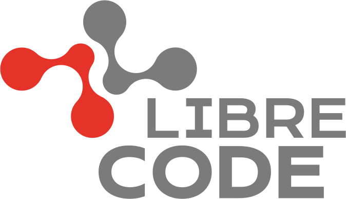

# Faça parte da LibreCode

A [LibreCode](https://librecode.coop) é uma cooperativa de devs de software livre em busca de uma forma de trabalhar diferente das que já experimentamos no mundo corporativo.

## Local de trabalho
:house: `0.0.0.0` ou `127.0.0.1`

## [Forma de adesão](docs/forma-contratacao.md)

## [Benefícios](docs/beneficios.md)

## [Pré-requisitos](docs/pre-requisitos.md)

## [Oportunidades](docs/oportunidades.md)

## Como se candidatar

* :star: Dê estrelinhas neste e em outros repos da LibreCode que curtir
* :heavy_check_mark: Atender aos [pré-requisitos](docs/pre-requisitos.md)
* :wave: Dar um oi em nosso [grupo público](https://t.me/LibreCodeCoop) informando que tem interesse em fazer parte do time

## Conheça mais sobre nós

   
